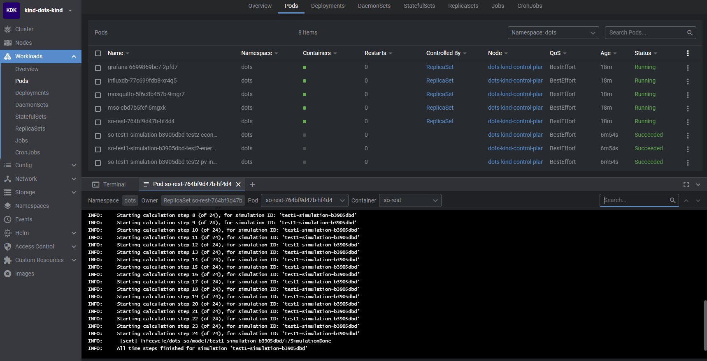

# Simulation Orchestrator for the Energy System Microservices Cloud Simulator

Based on [DOTs](https://github.com/dots-energy/). Previous working name DOTS.  
This simulation orchestrator is controlled by api calls (FastAPI) and uses helics to orchestrate a distributed simulation.

On the [MCS wiki](https://github.com/EES-TUe/dots-simulation-orchestrator/wiki) you can find a description of the framework along
with installation and usage details.

## Development

### Python environment

Create a python virtual environment (3.10) and install the dependencies:

```console
pip install pip-tools==6.10
pip-compile ./requirements.in --output-file ./requirements.txt
python -m pip install -r requirements.txt
```

### Push image

The github actions automatically deploy new versions of the SO to the github image registry.

## Local Deploy and testing

Deployment can be done on a cloud cluster or locally for testing.
For the TUE the framework in deployed on AKS, see

[wiki](https://github.com/EES-TUe/dots-simulation-orchestrator/wiki#installation).
How to deploy and test locally is described below.

### Local deploy

Two items need to be installed first: [kind](https://kind.sigs.k8s.io/) and
[kubectl](https://kubernetes.io/docs/tasks/tools/).
Installing kind and kubectl on Windows on WSL works well, other local cluster options have not been tried.

In the `k8s` folder you can find the `deploy_dots.sh` scripts which will:

- set up a cluster (on Azure or Kind) with `dots` namespace
- configure a kubernetes service account for the so to deploy pods
- deploy k8s env vars and secrets containing influxdb and grafana passwords
- deploy grafana, influxdb and SO

For the SO the 'imagePullPolicy' is set to 'Always'.

After deployment the simulator should be ready for use, see
[wiki](https://github.com/EES-TUe/dots-simulation-orchestrator/wiki#usage-run-a-simulation).

### Local testing

There are some dummy calculation services which can be used to test the framework.
On `<SO AKS IP>:8001/docs` (<SO AKS IP> is the Simulation Orchestrator Azure IP address), or for local kind cluster
`localhost:8011/docs`, do a POST request with `test_json.json` as body.  
This should run a simulation without errors, this can be checked in [Lens](https://github.com/MuhammedKalkan/OpenLens),
make sure to also install this [extension](https://github.com/alebcay/openlens-node-pod-menu#installing-this-extension).
An example cluster with a running simulation is displayed below:  

The first 5 pods contain the base components which should always be running. The other pods contain calculation service
models which will be cleaned up after the simulation.

## Description

Below is a description of the message structure and an overview of the repository.

## Repository Structure

The repository contains several folders with different purposes:

- **k8s:** Contains kubernetes deployment scripts and yaml files.
- **rest:** FastApi app.
- **simulation_orchestrator:** Code for managing simulations and hosting the fastapi.
- **.dockerignore:** A file containing which files and directories to ignore when submitting this repo as a Docker
  build context. In other words, it prevents the entries from being sent to Docker when the Docker image is build.
- **.gitignore:** A file containing which files and directories not to add to the git repository.
- **.github/workflows** The steps executed by the Github CI workflows when a new commit is pushed to the main branch of the repository
- **Dockerfile:** The build file for the Docker image.
- **requirements.txt:** The Python dependencies necessary to run the code to create a boilerplate project.
- **test_post.json:** POST request body for a test simulation.
